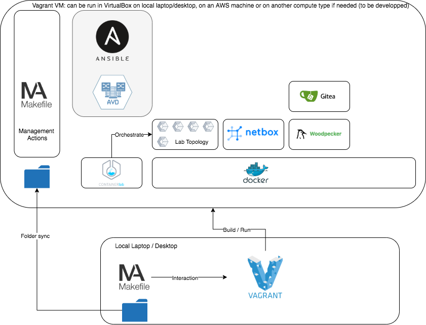

# EVPN Arista Containerlab in CICD


## Intro

This lab was created to help network engineers understand how EVPN works and how to use to operate it in a Devops way of working.

This is still a work in progress.

Status:

- [x] Makefile to control the actions
- [x] Vagrant with either a local VM or an AWS one. Install the necessary packages in the image to run the lab
- [x] Simple Lab with Containerlab (Arista for network devices, Custom Alpine for hosts)
- [x] Simple Lab configured with [Ansible Collection For Arista Validated Designs]()[¶](https://avd.sh/en/latest/#ansible-collection-for-arista-validated-designs)
- [x] Helper for CLI/SSH/PCAP on the devices. The capture happen on the host and launch wireshark on the laptop/destkop for easier analysis (the data transfer occurs over a ssh tunnel)
- [ ] Netbox populated with data model reprensenting the Lab configuration (80% done)
- [ ] Export of Netbox to the structured config part of AVD
- [ ] Netbox script to add a new network
- [ ] CICD with Gitea and Woodpecker to run AVD on Netbox datamodel change





## Usage

###  Prerequisites

Installation of [VirtualBox](https://www.virtualbox.org/wiki/Downloads), [Packer](https://www.packer.io/downloads), [Vagrant](https://www.vagrantup.com/downloads)  with the appropriate methods based on your OS.

### Using it

Copy the `.env.template` to `.env` and modify accordingly the variables for your setup.

You can also create the `.env_Makefile` and fulfill with the function needed for AWS auth in your setup. Or you can just copy paste the AWS_ACCESS_KEY_ID/AWS_SECRET_ACCESS_KEY/AWS_SESSION_TOKEN as environment varaiable.

Then you just have to follow the help:

```
❯ make                                                                                                                                                                       
Usage

                      -- Help Section --

help:                 This help message
                      (can be triggered either by make or make help)

                      -- Initial Setup --

vagrantinstall:       Install on the current device the Vagrant plugin needed

                      -- ☁️  AWS Combined Actions --

startupaws:           1️⃣️  (Laptop 👨‍💻) 🔓 login on AWS and launch the AWS instance
setupaws:             2️⃣️  (Inside 🎛 ) ⚙️  setup prerequisites on the AWS instance (should be done only once)
spinaws:              3️⃣️  (Inside 🎛 ) ▶️  launch lab on the AWS instance
haltaws:                 (Laptop 👨‍💻) ⏹️  Stop the AWS instance
destroyaws:              (Laptop 👨‍💻) 🧨  Destroy the AWS instance

                      -- 💻️ Local Combined Actions --

startuplocal:         1️⃣️  (Laptop 👨‍💻) 🎬 build and/or launch the local VM
setuplocal:           2️⃣️  (Inside 🎛 ) ⚙️  setup prerequisites on the local VM (should be done only once)
spinlocal:            3️⃣️  (Inside 🎛 ) ▶️  launch lab on the local VM
haltlocal:               (Laptop 👨‍💻) ⏹️  Stop the local VM
destroylocal:            (Laptop 👨‍💻) 🧨  Destroy the local VM
connectlocal:            (Laptop 👨‍💻)   Connect to the local VM

                      -- AWS Setup --

awssetup:             Setup the packages needed on the AWS VM
awsssh:               Get the public IP of the VM for direct SSH
awsvmstatus:          AWS VM status
awsvmup:              Spin up an AWS instance

                      -- Lab Setup & Control--

cleanceos:            Clean /var/tmp/agents/core*
awsceosimage:         Copy & Import the CEOS image into the docker registry
localceosimage:       Copy & Import the CEOS image into the docker registry
images:               Build the container image to use as an end device
tinylabup:            ▶️  Start the tiny lab (3 nodes)
tinylabdown:          ⏹️  Stop the lab (3 nodes)
labup:                ▶️  Start the lab
labdown:              ⏹️  Stop the lab
labclean:             Force clean the lab (needed in case of issues)

                      -- Ansible Section --

ansible-setup:        Setup Ansible and Arista AVD Collection
ansible-check:        Check that you can communicate with all the nodes
ansible-folder:       Create the folder structure needed for AVD
ansible-config:       Create the intented config for the lab
ansible-deploy:       Generate, deploy and validate the config for the lab
ansible-nethost:      Configure the host networking

                      -- Tooling --

tooling-start:        Start Netbox / Gitea / Woodpecker
tooling-stop:         Stop Netbox / Gitea / Woodpecker
netbox-update:        Update Netbox-docker
netbox-start:         Start Netbox
netbox-stop:          Stop Netbox
netbox-logs:          Logs Netbox
woodpecker-start:     Start Woodpecker
woodpecker-stop:      Stop Woodpecker
woodpecker-logs:      Logs Woodpecker
gitea-start:          Start Gitea
gitea-stop:           Stop Gitea
gitea-logs:           Logs Gitea

                      -- Nodes Access --

cli-%:                🌐 Allow acces to the EOS Cli (valid only with EOS nodes) : cli-$NODENAME
bash-%:               🔗 Allow acces to the bash shell : bash-$NODENAME
ip-host:              Print Server IPs
pcap-%-eth0:          (Laptop 👨‍💻) PCAP Capture on Wireshark on the % node name interface. Works with eth[0-4] (this one is here as example for the help)

                     # -- Woodpecker Setup --


                     # -- AWS Setup --

awslogin:             Login to AWS. Don't forget to copy paste the output as env vars.
awsexportenv:         Export AWS Creds to Var
```

